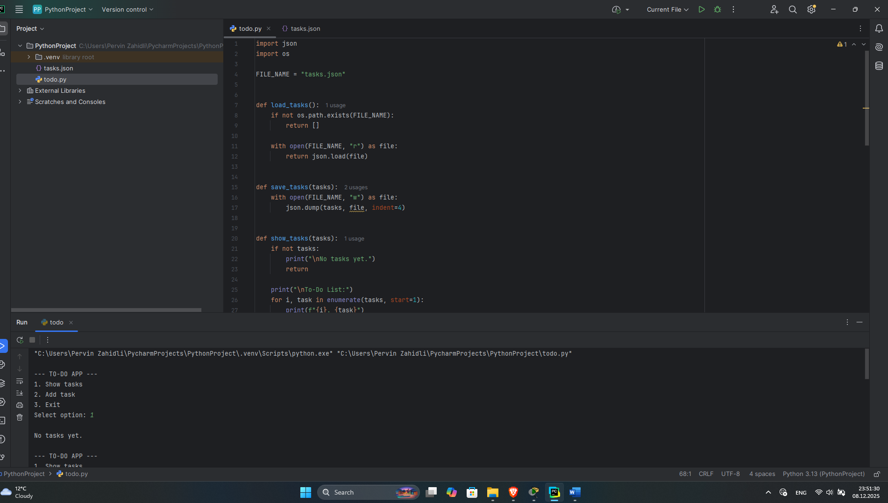
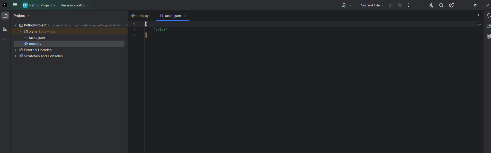
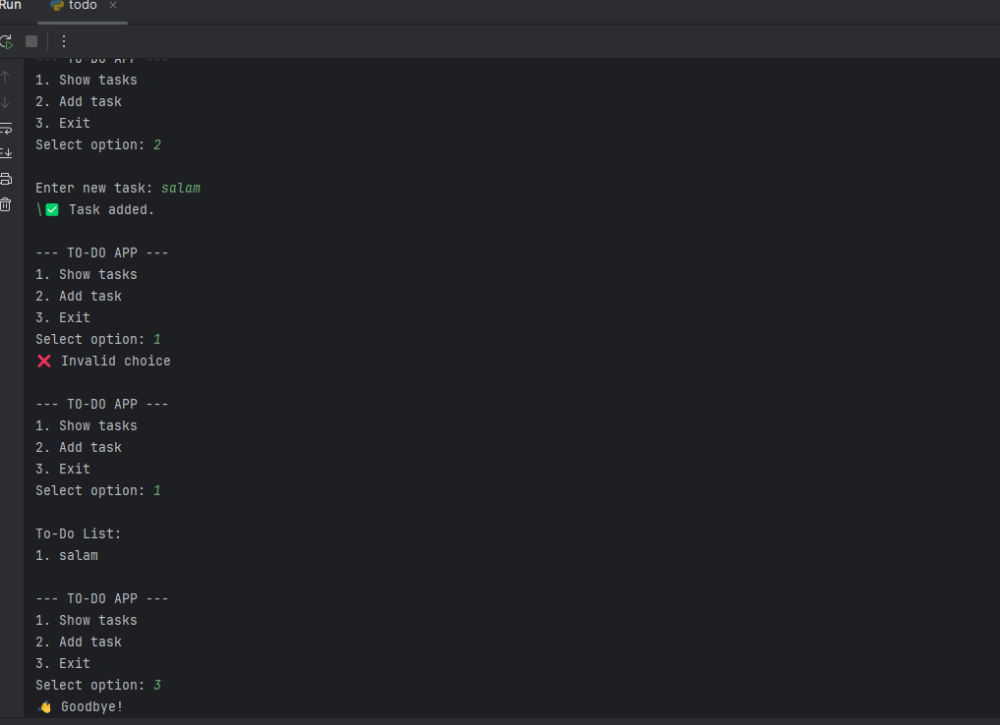

# Cyberpython-task4





# Python To-Do List Application

## Introduction
This project is a simple Python-based To-Do List application designed to help users manage daily tasks effectively. The application uses a JSON file to store tasks permanently, allowing data to be saved and loaded each time the program is executed.

---

## Application Description
The To-Do List application allows users to view existing tasks, add new tasks, and store all tasks in a JSON file. The program runs in a console environment and is suitable for beginners learning file handling and data storage in Python.

---

## Use of JSON File
A JSON file is used as the data storage format because it is lightweight, human-readable, and easy to handle in Python. All tasks are stored as a list in the `tasks.json` file. Each time a task is added, the file is automatically updated.

---

## Program Functionality
- Loads existing tasks from a JSON file at startup  
- Displays all tasks to the user in an ordered list  
- Allows the user to add new tasks through keyboard input  
- Saves all changes back to the JSON file  
- Prevents empty tasks from being added  

---

## Technical Implementation
The application is implemented using built-in Python libraries such as `json` and `os`. The `json` module is used to read and write structured data, while the `os` module is used to check whether the JSON file exists before loading it.

The program follows a modular structure with separate functions for loading tasks, saving tasks, displaying tasks, and adding new tasks. This improves code readability and maintainability.

---

## User Interaction
Users interact with the program through a simple text-based menu. By selecting options from the menu, users can view tasks, add new tasks, or exit the application. All user inputs are processed safely to avoid invalid entries.

---

## Conclusion
This project demonstrates basic concepts of Python programming, including file handling, JSON data storage, user input processing, and modular coding. The application can be extended further by adding features such as task deletion, task completion status, or a graphical user interface.


#CODE
  ```
  import json
  import os
  
  FILE_NAME = "tasks.json"
  
  
  def load_tasks():
      if not os.path.exists(FILE_NAME):
          return []
  
      with open(FILE_NAME, "r") as file:
          return json.load(file)
  
  
  def save_tasks(tasks):
      with open(FILE_NAME, "w") as file:
          json.dump(tasks, file, indent=4)
  
  
  def show_tasks(tasks):
      if not tasks:
          print("\nNo tasks yet.")
          return
  
      print("\nTo-Do List:")
      for i, task in enumerate(tasks, start=1):
          print(f"{i}. {task}")
  
  
  def add_task(tasks):
      task = input("\nEnter new task: ")
      if task.strip():
          tasks.append(task)
          print("✅ Task added.")
      else:
          print("❌ Empty task not added.")
  
  
  def main():
      tasks = load_tasks()
  
      while True:
          print("\n--- TO-DO APP ---")
          print("1. Show tasks")
          print("2. Add task")
          print("3. Exit")
  
          choice = input("Select option: ")
  
          if choice == "1":
              show_tasks(tasks)
  
          elif choice == "2":
              add_task(tasks)
              save_tasks(tasks)
  
          elif choice == "3":
              save_tasks(tasks)
              print("👋 Goodbye!")
              break
  
          else:
              print("❌ Invalid choice")
  
  
  if __name__ == "__main__":
      main()
  ```
